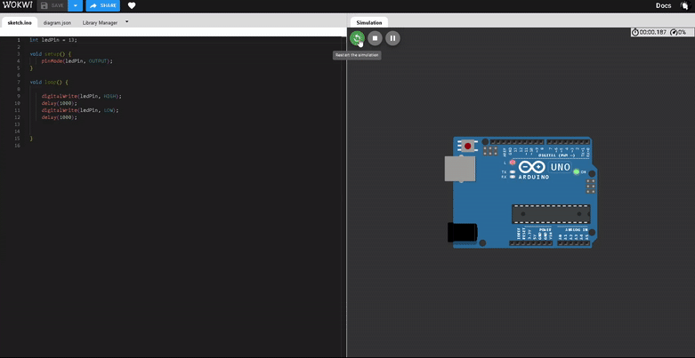
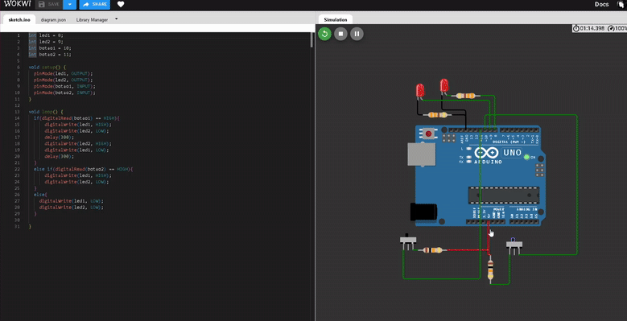
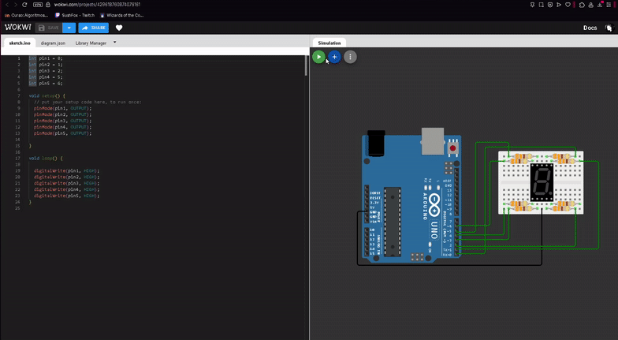

# Relatório de Atividades - Laboratório de Microcontroladores e Microprocessadores  
**Aula 02 — Construção de Circuitos com Entradas e Saídas Digitais no Arduino**  

---

## 👥 Nome da Dupla  

<div align="center">

| **Arthur Mendonça** | **Álvaro Silva** |
|:-------------------:|:-----------------:|
| [](https://github.com/ImArthz) | [](https://github.com/alvaroajs) |  

</div>


## Exercício 1: Hello World com Arduino  

### Objetivo:  
Simular o circuito "Olá Mundo" no Arduino utilizando o Wokwi, onde um LED pisca em intervalos regulares.  

### Código:  
```
int ledPin = 13;

void setup() {
    pinMode(ledPin, OUTPUT);
}

void loop() {
    digitalWrite(ledPin, HIGH);
    delay(1000);
    digitalWrite(ledPin, LOW);
    delay(1000);
}
```
### Funcionamento:  
O LED conectado ao pino digital 13 do Arduino é acionado (HIGH) por 1 segundo e desligado (LOW) por mais 1 segundo, repetindo-se indefinidamente.  

### Demonstração Visual:  
<div align="center">
  
  <br>
  <em>Circuito Hello World: LED piscando no Arduino .</em>
</div>

### Link para o Projeto no Wokwi:  
[](https://wokwi.com/projects/429127490644502529)

----------------------------------------

## Exercício 2: Controle de LEDs com Botões  

### Objetivo:  
Criar um circuito com dois botões que controlam dois LEDs (vermelho e verde), alternando seus estados conforme a interação dos botões.  

### Componentes Principais:  
- 2 LEDs (vermelho e verde)  
- 2 botões  
- 2 resistores de 330Ω (para LEDs)  
- 2 resistores de 10kΩ (para botões)  
- Arduino Uno  

### Código:  
```
int led1 = 8;
int led2 = 9;
int botao1 = 10;
int botao2 = 11;

void setup() {
  pinMode(led1, OUTPUT);
  pinMode(led2, OUTPUT);
  pinMode(botao1, INPUT);
  pinMode(botao2, INPUT);
}

void loop() {
  if(digitalRead(botao1) == HIGH){
      digitalWrite(led1, HIGH);
      digitalWrite(led2, LOW);
      delay(300);
      digitalWrite(led2, HIGH);
      digitalWrite(led1, LOW);
      delay(300);
  }
  else if(digitalRead(botao2) == HIGH){
      digitalWrite(led1, HIGH);
      digitalWrite(led2, LOW);
  }
  else{
    digitalWrite(led1, LOW);
    digitalWrite(led2, LOW);
  }
}
```
### Funcionamento:  
1. Botão 1 (Pino 10):  
   - Quando pressionado, os LEDs  a cada 300ms (efeito piscante).  
2. Botão 2 (Pino 11):  
   - Quando pressionado, aciona apenas o primeiro LED que está mais acima , o de baixo permanece apagado).  
3. Sem pressionamento:  
   - Ambos os LEDs permanecem apagados.  

### Demonstração Visual:  
<div align="center">
  
  <br>
  <em>Funcionamento do circuito: alternância de LEDs controlada por botões.</em>
</div>

### Link para o Projeto no Wokwi:  
[](https://wokwi.com/projects/429612069389450241)

----------------------------------------

### Observação:  
Os resistores de 10kΩ garantem um estado definido para os botões (pull-down), evitando leituras flutuantes no Arduino.  

----------------------------------------

# Exercício 3: Display de 7 Segmentos com Número 9  

### Objetivo:  
Projetar um circuito com Arduino e display de 7 segmentos para exibir o número 9, utilizando pinos digitais de 0 a 7 para controlar os segmentos.  

---

### Componentes Principais:  
- Display de 7 segmentos (catodo comum)  
- 7 resistores de 330Ω (para os segmentos do display)  
- Arduino Uno  

---

### Código:  
```cpp
int pin1 = 0;  // Segmento A
int pin2 = 1;  // Segmento B
int pin3 = 2;  // Segmento C
int pin4 = 5;  // Segmento D
int pin5 = 6;  // Segmento F 

void setup() {
  pinMode(pin1, OUTPUT);
  pinMode(pin2, OUTPUT);
  pinMode(pin3, OUTPUT);
  pinMode(pin4, OUTPUT);
  pinMode(pin5, OUTPUT);
}

void loop() {
  // Ativa os segmentos necessários para o número 9:
  digitalWrite(pin1, HIGH);  // Segmento A
  digitalWrite(pin2, HIGH);  // Segmento B
  digitalWrite(pin3, HIGH);  // Segmento C
  digitalWrite(pin4, HIGH);  // Segmento D
  digitalWrite(pin5, HIGH);  // Segmento F
}
```
### Funcionamento:  
Para exibir o número **9** em um display de 7 segmentos (catodo comum):  
- **Segmentos ativados:** A, B, C, D, F, G.  
- **Segmento desativado:** E.  
- **Conexões no Arduino:**  
  - Pinos 0 a 7 mapeados para os segmentos *a* a *g* .  

---

### Demonstração Visual:  
<div align="center">
  
  <br>
  <em>Circuito em funcionamento: número 9 no display de 7 segmentos.</em>
</div>

---

### Link para o Projeto no Wokwi:  
[](https://wokwi.com/projects/429618760874076161)

---

### Observações:  
- **Resistores:** Os resistores de 330Ω são usados para limitar a corrente nos segmentos do display.  
